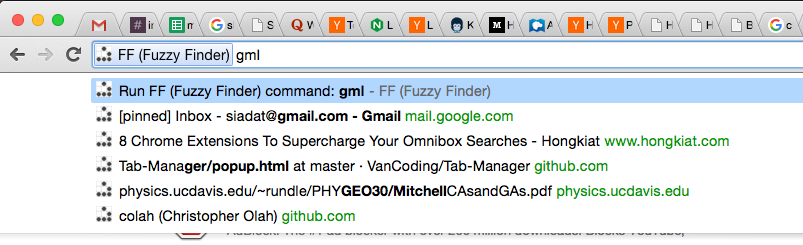

# Fuzzy Finder for Chrome

Adds fuzzy tab search to the omnibox.  Type `ff query` in your address bar to search for `query` in your tab titles and urls.

  

## Install

Download [chrome-ff.crx](https://github.com/siadat/chrome-ff/releases/download/1.0/chrome-ff.crx)
and drop it in your `chrome://extensions/` page.
